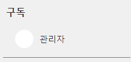

# 스프링부트 + 리액트(타입스크립트) 블로그 포트폴리오

## 개요
리액트(타입스크립트)와 스프링 데이터 JPA 및 Querydsl를 학습하고 해당 기술을 활용하는 방법을 이해하기 위해 유튜브 레이아웃을 참고하여 블로그를 제작(YouBlog)   
 

## 프로젝트 기간
2023.03 ~ 2023.05
 

## 개발환경
#### 백앤드 개발환경
|이름|버전|
|:--:|:--:|
| 스프링부트 | 2.6.14 |
| MariaDB | 10.5 |
| QueryDSL | 5 |

#### 프론트앤드 개발환경
|이름|버전|
|:--:|:--:|
| 리액트 | 18.2.0 |
| 타입스크립트 | 4.9.3 |

## ERD

   

# 주요 기능
1. [소셜로그인(카카오) 및 회원가입](#소셜로그인카카오-및-회원가입)
2. [즐겨찾기](#즐겨찾기)
3. [구독](#구독)
4. [검색](#검색)
5. [그외](#그-외)
  

# 소셜로그인(카카오) 및 회원가입
## 카카오 로그인
카카오톡 아이콘을 클릭하면 카카오톡 API로 코드를 요청하여 전달 받은 코드를 백앤드 서버로 전달, 백앤드 서버에서는 전달 받은 토큰을 FeignClient 라이브러리를 활용하여
재차 카카오톡 유저정보 API로 요청하여 해당 로그인 유저정보가 존재할 시 내부 데이터베이스에 유저 정보를 저장 하고 로그인 상태로 만들어 메인 페이지로 이동

  

## 일반 회원가입
가입 시 작성한 이메일로 인증메일 전송(gmail), 인증메일을 클릭하면 인증이 완료되고 인증된 사용자는 블로그 개설 및 글작성이 가능   
로컬 환경에서는 콘솔창에 인증링크를 띄워서 링크 클릭 시 인증처리 됨, 실제 메일전송은 profiles dev 환경에서 가능

  

# 즐겨찾기
블로그 게시글 우측 메뉴를 클릭하면 즐겨찾기 등록 가능, 등록한 즐겨찾기는 사이드메뉴의 즐겨찾기 페이지로 들어가면 확인할 수 있다.   

  

# 구독
블로그 게시글 우측 메뉴를 클릭하거나 해당 블로거 페이지로 가면 구독 가능, 등록한 구독자는 사이드메뉴의 구독란에 표시 되며 클릭 시 바로 해당 블로거 페이지 페이지로 이동할 수 있다.   

  

# 검색
메인 페이지 헤더 검색창에 검색할 키워드를 입력하면 원하는 게시글을 찾을 수 있다. 검색 범위는 제목, 내용, 태그로 검색하여 출력된다.   

  

# 그 외
* 내 블로그 배경 꾸미기
* 메인에 깃허브 캘린터를 활용하여 게시글을 등록한 날짜에 색 추가
* 개인 아바타 프로필 변경
* 비밀번호 찾기
* 닉네임 변경